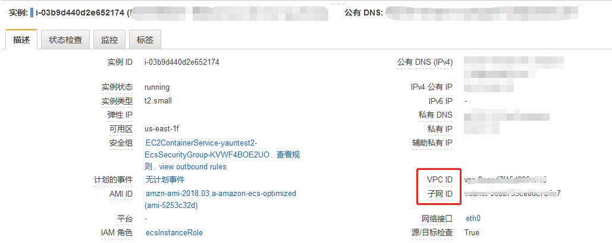
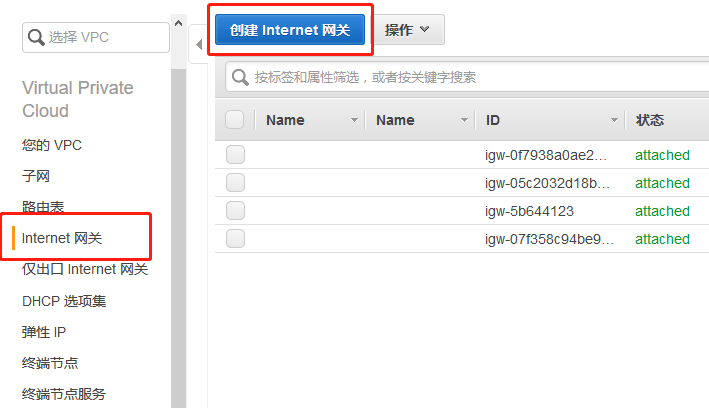
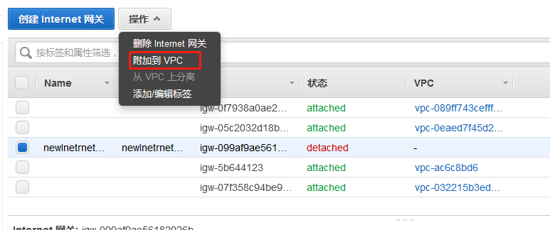
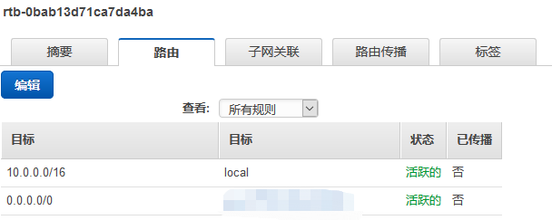
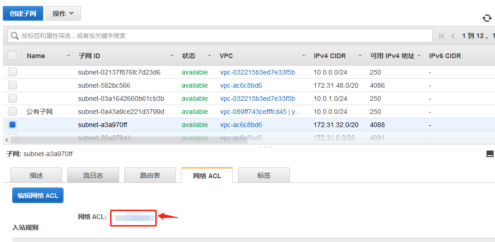
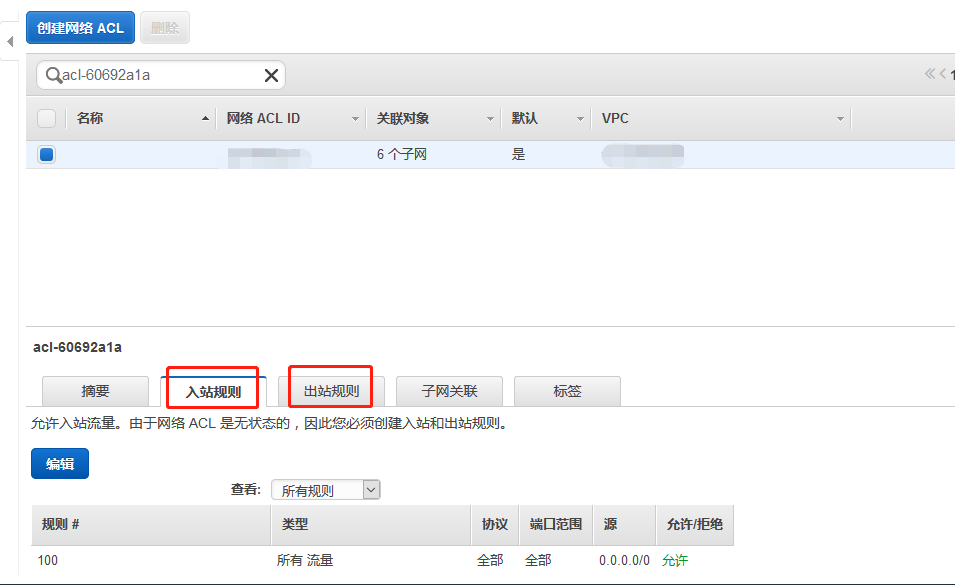

[TOC]
# 连接超时
如果在连接到您的实例时看到以下错误消息：

```
Network error: Connection timed out 或 Error connecting to [instance], reason: -> Connection timed out: connect
```
请尝试以下选项： 
- 检查您的安全组规则。您的某个安全组规则应该允许适当的端口传输来自公有 IPv4 地址的入站流量。
    1. [打开 Amazon EC2 控制台](https://console.aws.amazon.com/ec2/)。
    2. 在导航窗格中，选择 Instances，然后选择您的实例。
    3. 在 Description 选项卡中的 Security groups 旁边，选择 view rules 以显示有效规则的列表。
    
    **对于 Linux实例**：验证是否有允许流量从您的计算机到端口 22 (SSH) 的规则。若无请[添加对于端口22的入站规则](#securityGroup)。
    
    **对于 Windows 实例**：验证是否有允许流量从您的计算机到端口 3389 (RDP) 的规则。若无请[添加对于端口3389的入站规则](#securityGroup)。

    如果您的安全组具有允许来自单个 IP 地址的入站流量的规则，则当您的计算机在企业网络上，或当您通过 Internet 服务提供商 (ISP) 进行连接时，此地址可能不是静态的。请改为指定客户端计算机使用的 IP 地址的范围。
- [EC2-VPC] 查看子网的路由表。您需要使用某个路由，以将发往 VPC 外部的所有流量发送到 VPC 的 Internet 网关。
    1. [打开 Amazon EC2 控制台](https://console.aws.amazon.com/ec2/)。
    2. 在导航窗格中，选择 Instances，然后选择您的实例。
    3. 在 Description 选项卡中，记下 VPC ID 和 Subnet ID 的值。
    
    4. [打开 Amazon VPC 控制台](https://console.aws.amazon.com/vpc/)
    5. 在导航窗格中，选择 Internet Gateways。验证是否有 Internet 网关附加到您的 VPC。否则，选择 Create Internet Gateway 以创建 Internet 网关。选择 Internet 网关，然后选择 Attach to VPC 并按照说明将其连接到您的 VPC。
    6. 在导航窗格中，选择 Subnets，然后选择您的子网。
    7. 在 Route Table 选项卡上，验证 0.0.0.0/0 的路由是否为目的地以及您的 VPC 的 Internet 网关是否为目标。如果不是，请选择路由表的 ID (rtb-xxxxxxxx) 以导航到路由表的 Routes 选项卡，选择 Edit、Add another route，在 Destination 中输入 0.0.0.0/0，从 Target 中选择您的 Internet 网关，然后选择 Save。
    
       
    
    如果您使用实例的 IPv6 地址连接到实例，请检查是否有一个路由可以将所有 IPv6 流量 (::/0) 指向 Internet 网关。如果没有，请添加一个以 ::/0 为目的地并指向 Internet 网关的路由。
- [EC2-VPC] 检查子网的网络访问控制列表 (ACL)。该网络 ACL 必须允许适当的端口传输来自本地 IP 地址的入站和出站流量。默认网络 ACL 允许所有入站和出站流量。
    1. [打开 Amazon VPC 控制台](https://console.aws.amazon.com/vpc/)
    2. 在导航窗格中，选择 Subnets，然后选择您的子网。
    3. 在 Summary 选项卡上，找到 Network ACL，然后选择其 ID (acl-xxxxxxxx)
    4. 选择网络 ACL。对于 Inbound Rules，验证规则是否允许来自您的计算机的流量。如果不允许，请删除或修改阻止来自您的计算机的流量的规则。
    5. 对于 Outbound Rules，验证规则是否允许到您的计算机的流量。如果不允许，请删除或修改阻止到您的计算机的流量的规则。

- 如果您的计算机在企业网络上，请询问网络管理员内部防火墙是否允许端口 **22** ( **Linux** 实例) 或端口 **3389** (**Windows** 实例) 上来自您的计算机的入站和出站流量。
- 如果您的计算机有防火墙，请验证其是否允许端口 **22** (**Linux** 实例) 或端口 **3389** (**Windows** 实例) 上来自您的计算机的入站和出站流量。
- 检查您的实例是否具有公有 IPv4 地址。如果没有，您可以将弹性 IP 地址与您的实例关联。
- 检查实例上的 CPU 负载，服务器可能已超过负载。AWS 自动提供数据，例如 Amazon CloudWatch 指标和实例状态，您可以使用这些数据查看实例上 CPU 的负载情况
- 要使用 **IPv6** 地址连接实例，请检查以下各项：
    - 您的子网必须与一个路由表关联，此表中具有一个将 IPv6 流量 (::/0) 指向 Internet 网关的路由。
    - 您的安全组规则必须允许适当端口 (**Linux 的22 或Windows的3389端口**) 传输来自本地 IPv6 地址的入站流量。
    - 您的网络 ACL 规则必须允许入站和出站 IPv6 流量。
    - 如果您从旧版 AMI 启动实例，则其可能未针对 DHCPv6 进行配置 (IPv6 地址不会在网络接口上自动识别)。
    - 您的本地计算机必须拥有 IPv6 地址，且必须配置为使用 IPv6。
# 服务器无法识别用户密钥
- 如果您使用 SSH 连接到实例
    - 请在连接时使用 ssh -vvv 获得三倍的详细调试信息：
```
ssh -vvv -i [your key name].pem ec2-user@[public DNS address of your instance].compute-1.amazonaws.com
```
    
下列样本输出演示了如果您尝试使用服务器无法识别的密钥连接实例时您可能会看到的信息：

```
open/ANT/myusername/.ssh/known_hosts).
debug2: bits set: 504/1024
debug1: ssh_rsa_verify: signature correct
debug2: kex_derive_keys
debug2: set_newkeys: mode 1
debug1: SSH2_MSG_NEWKEYS sent
debug1: expecting SSH2_MSG_NEWKEYS
debug2: set_newkeys: mode 0
debug1: SSH2_MSG_NEWKEYS received
debug1: Roaming not allowed by server
debug1: SSH2_MSG_SERVICE_REQUEST sent
debug2: service_accept: ssh-userauth
debug1: SSH2_MSG_SERVICE_ACCEPT received
debug2: key: boguspem.pem ((nil))
debug1: Authentications that can continue: publickey
debug3: start over, passed a different list publickey
debug3: preferred gssapi-keyex,gssapi-with-mic,publickey,keyboard-interactive,password
debug3: authmethod_lookup publickey
debug3: remaining preferred: keyboard-interactive,password
debug3: authmethod_is_enabled publickey
debug1: Next authentication method: publickey
debug1: Trying private key: boguspem.pem
debug1: read PEM private key done: type RSA
debug3: sign_and_send_pubkey: RSA 9c:4c:bc:0c:d0:5c:c7:92:6c:8e:9b:16:e4:43:d8:b2
debug2: we sent a publickey packet, wait for reply
debug1: Authentications that can continue: publickey
debug2: we did not send a packet, disable method
debug1: No more authentication methods to try.
Permission denied (publickey).

```
- 如果您使用 SSH (MindTerm) 连接到实例 
    - 请检查是否已经安装java 
在cmd中输入 Java查看是否存在该命令，若无请[安装Java](https://java.com/en/download/help/index_installing.xml)
    - 是否在浏览器中启用Java？ 如果未启用 Java，则服务器不会识别该用户密钥。
    - 若是**Linux**实例请切换到**root**角色， 若是**windows**：用**管理员**权限打开浏览器
    - 请根据不同浏览器选择进行不同操作：
        - Internet Explorer
            - 单击工具，然后单击 Internet 选项
            - 选择安全选项卡，选择自定义级别按钮
            - 向下滚动到 Java 小应用程序脚本
            - 确保选中启用单选按钮
            - 单击确定保存您的首选设置
        - Chrome
            - 单击扳手图标，然后选择选项。
            - 依次选择高级选项和隐私内容设置。
            - 将显示“内容设置”面板。
            - 在插件部分，选择禁用单独插件链接以检查是否已启用 Java
            - 单击启用链接（如果显示“禁用”链接，则已启用 Java）
            - 注意：此外，您也可通过在浏览器地址栏中 键入“about:plugins” 来访问“插件”设置。 
         - Firefox
            - 启动 Mozilla Firefox 浏览器，如果该浏览器正在运行，则重新启动它。
            - 在浏览器顶部，选择 Firefox 按钮，然后选择附加组件
            - 此时将打开“附加组件管理器”选项卡。
            - 在“附加组件管理器”选项卡中，选择插件
            - 单击 Java (TM) 平台插件以将其选定
            - 单击启用按钮（如果按钮显示为禁用，则 Java 已启用）
        - Safari
            - 启动 Safari 浏览器
            - 单击“Safari”并选择首选项
            - 单击安全选项卡
            - 选中（选择）启用 Java 复选框
            - 关闭“Safari 首选项”窗口
        - [Reference](https://java.com/en/download/help/enable_browser.xml)
    - 在连接中请选择 Yes 以信任证书，然后选择 Run 以运行 MindTerm 客户端。如果这是您第一次运行 MindTerm，则会出现一系列对话框，要求您接受许可协议、确认主目录的设置以及确认已知主机目录的设置。确认这些设置。
    
 - 如果您使用 PuTTY 连接到实例
    - [验证您的私有密钥 (.pem) 文件已经转换为 PuTTY (.ppk) 可以识别的格式。](https://docs.aws.amazon.com/zh_cn/AWSEC2/latest/UserGuide/putty.html#putty-private-key)
    - 在 PuTTYgen 中，加载您的私有密钥文件并选择 Save Private Key (保存私有密钥) 而不是 Generate (生成)。
    - 验证您在连接时是否对为 AMI 使用了[正确的用户名称](#username)。在 PuTTY Configuration (PuTTY 配置) 窗口的 Host name (主机名) 框中输入用户名.
    - 验证您的入站安全组规则允许入站流量进入合适的端口。若无请[添加相应入站规则](#securityGroup)

# 未找到主机密钥，权限被拒绝 (publickey)，或者 身份验证失败，权限被拒绝
如果您使用 SSH 连接到实例并得到以下任一错误 Host key not found in [directory]、Permission denied (publickey) 或 Authentication failed, permission denied
- 请验证您使用了 AMI 的相应用户名称进行连接且 已为实例指定正确的私有密钥 (.pem) 文件。
- 对于 MindTerm 客户端，在 Connect To Your Instance (连接到您的实例) 窗口中的 User name (用户名称) 框中是否输入了[正确的用户名称](#username)。
- 请确认您使用的私有密钥文件对应于您启动实例时选择的密钥对
    1. [打开 Amazon EC2 控制台](https://console.aws.amazon.com/ec2/)
    2. 选择实例。在 Description 选项卡上，验证 Key pair name 的值
    3. 如果您启动实例时没有指定密钥对，则可以终止实例并启动新实例，从而确保指定密钥对。如果这是您一直使用的实例，但您不再有密钥对的 .pem 文件，则可以使用新的密钥对取代该密钥对。
    4. 如果您已经生成了您自己的密钥对，请确保您的密钥生成器被设置为创建 RSA 密钥。不接受 DSA 密钥。
- 如果您遇到 Permission denied (publickey) 错误但以上情况都不适用 (例如，您之前能够连接)，则可能是实例主目录的权限发生了更改。/home/ec2-user/.ssh/authorized_keys 的权限必须限制为仅限所有者。

# 未保护的私钥文件
必须保护您的私钥文件，防止其他任何用户对其进行读写操作。如果除您外其他任何人都能够读取或写入您的私钥，则 SSH 会忽略您的密钥，并且您会看到以下警告消息。


```
@@@@@@@@@@@@@@@@@@@@@@@@@@@@@@@@@@@@@@@@@@@@@@@@@@@@@@@@@@@
@         WARNING: UNPROTECTED PRIVATE KEY FILE!          @
@@@@@@@@@@@@@@@@@@@@@@@@@@@@@@@@@@@@@@@@@@@@@@@@@@@@@@@@@@@
Permissions 0777 for '.ssh/my_private_key.pem' are too open.
It is required that your private key files are NOT accessible by others.
This private key will be ignored.
bad permissions: ignore key: .ssh/my_private_key.pem
Permission denied (publickey).

```
如果在尝试登录到您的实例时看到类似的消息，请检查此错误消息的第一行，验证您为实例使用的公钥是否正确。要修复此错误，请执行以下命令，替入您的私钥文件的路径。

```
[ec2-user ~]$ chmod 0400 .ssh/my_private_key.pem
```
# 服务器拒绝我们的密钥或 没有支持的身份验证方法 

如果在使用 PuTTY 连接到您的实例时收到以下两种错误之一：Error: Server refused our key 或 Error: No supported authentication methods available
- 请验证在连接时是否为 AMI 使用了[正确的用户名称](#username)。在 PuTTY Configuration (PuTTY 配置) 窗口的 User name (用户名) 框中输入用户名。 
- [您还应验证您的私有密钥 (.pem) 文件已经正确转换为 PuTTY (.ppk) 可以识别的格式](https://docs.aws.amazon.com/zh_cn/AWSEC2/latest/UserGuide/putty.html#putty-private-key)

# 在 Safari 浏览器上使用 MindTerm 时出错
如果您使用 MindTerm 连接到实例并且使用 Safari Web 浏览器，则可能会收到以下错误：


```
Error connecting to your_instance_ip, reason: 
 —> Key exchange failed: Host authentication failed
```

您必须更新浏览器的安全设置以允许 AWS 管理控制台在不安全模式下运行 JAVA 插件。
启用 JAVA 插件以便在不安全模式下运行
1. 在 Safari 中，保持 Amazon EC2 控制台打开，依次选择 Safari、Preferences、Security
2. 选择 Plug-in Settings (在较旧版本的 Safari 上，选择 Manage Website Settings)
3. 选择左侧的 Java 插件
4. 对于 Currently Open Websites，选择 AWS 管理控制台 URL 并选择 Run in Unsafe Mode
5. 统提示后，选择警告对话框中的 Trust，然后选择 Done

# 使用 macOS RDP 客户端时出错
如果您使用 Microsoft 网站的远程桌面连接客户端连接到 Windows Server 2012 R2 实例，则可能会收到以下错误：

```
Remote Desktop Connection cannot verify the identity of the computer that you want to connect to.
```
从 Apple iTunes 存储下载 Microsoft 远程桌面应用程序，然后使用该应用程序连接到实例。

# 无法对实例执行 Ping 操作
ping 命令是一种 ICMP 流量 - 如果您无法对实例执行 ping 操作，请确保您的入站安全组规则允许的 Echo Request 消息的 ICMP 流量来自所有资源，或来自从中发出命令的计算机或实例。

请确保您的出站安全组规则允许的 Echo Request 消息的 ICMP 流量发送到所有目标，或发送到您正在尝试对其执行 ping 操作的主机。

# 解决方法
<span id="securityGroup"></span>
## 使用控制台向安全组添加规则
1. [打开 Amazon EC2 控制台](https://console.aws.amazon.com/ec2/)
2. 在导航窗格中，选择安全组，然后选择相应安全组。
3. 在 Inbound 选项卡上，选择 Edit
4. 在对话框中选择添加规则并执行以下操作：
    1. 对于类型，请选择相应协议。
    2. 如果您选择自定义 TCP 或 UDP 协议，请在端口范围中指定端口范围。
    3. 如果您选择自定义 ICMP 协议，请从协议中选择 ICMP 类型名称，并从端口范围中选择代码名称 (如果适用)。
    4. 对于源，请选择下列选项之一：
        - 自定义：在提供的字段中，您必须用 CIDR 表示法指定一个 IP 地址、CIDR 块或者其他安全组。
        - 任何位置：自动添加 0.0.0.0/0 IPv4 CIDR 块。使用该选项后，指定类型的所有流量都可达到您的实例。这在测试环境中可以接受一小段时间，但是在生产环境中并不安全。在生产中，请仅授权特定 IP 地址或地址范围访问您的实例。
        - 如果您的安全组位于已启用 IPv6 的 VPC 中，选择任何位置选项后，系统会创建两个规则，一个用于 IPv4 流量 (0.0.0.0/0)，一个用于 IPv6 流量 (::/0)。
        - 我的 IP：自动添加本地计算机的公有 IPv4 地址。
    5.  对于描述，您可以选择指定规则的描述。
5. 选择 Save。
6. 对于 VPC 安全组，您还可以指定出站规则。在出站选项卡中，依次选择编辑、添加规则，并执行以下操作：
    - 对于类型，请选择相应协议。
    - ?    如果您选择自定义 TCP 或 UDP 协议，请在端口范围中指定端口范围。
    - ?	如果您选择自定义 ICMP 协议，请从协议中选择 ICMP 类型名称，并从端口范围中选择代码名称 (如果适用)。
    - ?	对于目标，请选择下列选项之一：
        - 自定义：在提供的字段中，您必须用 CIDR 表示法指定一个 IP 地址、CIDR 块或者其他安全组。
        - 任何位置：自动添加 0.0.0.0/0 IPv4 CIDR 块。该选项允许出站流量流向所有 IP 地址。
        - 如果您的安全组位于已启用 IPv6 的 VPC 中，选择任何位置选项后，系统会创建两个规则，一个用于 IPv4 流量 (0.0.0.0/0)，一个用于 IPv6 流量 (::/0)。
        - 我的 IP：自动添加本地计算机的 IP 地址。
    - ?	对于描述，您可以选择指定规则的描述。
- 选择 Save


<span id="username"></span>
## 正确的用户名如下所示：
- 对于 Amazon Linux AMI，用户名为 ec2-user。 
- 对于 Centos AMI，用户名称是 centos。 
- 对于 Debian AMI，用户名称是 admin 或 root。 
- 对于 Fedora AMI，用户名为 ec2-user 或 fedora。 
- 对于 RHEL AMI，用户名称是 ec2-user 或 root。 
- 对于 SUSE AMI，用户名称是 ec2-user 或 root。 
- 对于 Ubuntu AMI，用户名称是 ubuntu 或 root。 
- 另外，如果 ec2-user 和 root 无法使用，请与 AMI 供应商核实。
